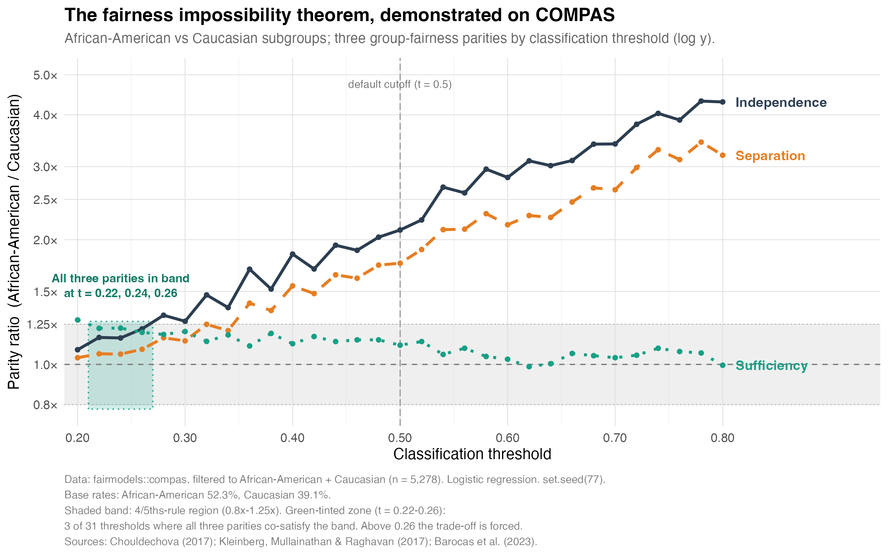
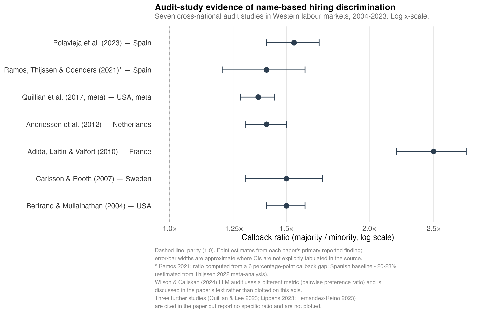
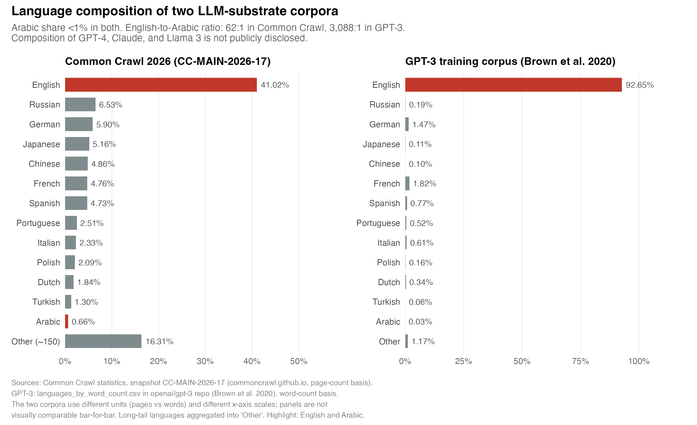

# The Algorithmic Right to Have Rights

**Arendt, the EU AI Act, and the Limits of Bias-Mitigation in Multicultural Labour Markets**

Abdullah Tadmuri · Universidad Carlos III de Madrid · May 2026

Final paper for *Social and Ethical Issues of Big Data and AI*, MSc in Computational Social
Science (UC3M). Awarded Matrícula de Honor.

> **Note on the legal timeline.** The paper was submitted on 22 May 2026. The **Digital Omnibus on
> AI**, adopted in June 2026, has since deferred stand-alone Annex III high-risk obligations from
> 2 August 2026 to **2 December 2027**. This narrows the asymmetry Section 7 analyses, though the
> Annex X migration and border systems remain at **31 December 2030** and were not revisited. The
> impossibility result, the audit-study evidence and the Arendtian argument are unaffected. See
> **[ADDENDUM.md](ADDENDUM.md)** for the full record. The paper is left as submitted.

---

## Summary

The EU AI Act (Regulation 2024/1689) anchors fundamental-rights protection in a bias-mitigation
regime: data governance (Art. 10), human oversight (Art. 14), Fundamental Rights Impact Assessment
(Art. 27), and a right to explanation (Art. 86). This paper argues that the regime rests on a
universalist gesture, the reduction of fairness to group-statistical equality, and that the gesture
fails along two homologous axes.

**Internally**, the Chouldechova and Kleinberg-Mullainathan-Raghavan impossibility theorem proves
that no classifier can jointly satisfy independence, separation and sufficiency when subgroup base
rates differ. The choice among the three is political, not technical, and Article 10 cannot tell a
deployer which to satisfy.

**Externally**, Arendt's analysis of the "right to have rights" (1951) shows that the polity
producing those base rates has already excluded the populations whose protection the regime most
needs to demonstrate.

The two failures are not independent. They are two expressions of one operationalisation error.
Article 111's deferral of large-scale migration-AI enforcement to 31 December 2030 makes that
deferral textual.

The paper does not argue that the AI Act should be abandoned, nor that algorithmic governance is
inherently incompatible with justice. It argues that bias-mitigation, as currently operationalised,
cannot deliver what its rhetoric promises.

## Method

A convergent mixed-methods design:

- Textual analysis of Arendt (1951) and Regulation 2024/1689
- Synthesis of seven cross-national hiring-audit studies, 2004 to 2023, plus a 2024 LLM-side audit
- An empirical fairness-impossibility demonstration on the COMPAS dataset
- Three autoethnographic vignettes, licensed by Ellis et al. (2011) and following
  Costanza-Chock (2018), which triangulate the argument rather than anchor it

## Figures

Figure numbering follows the paper. Each figure is produced by the script named beneath it.

### Figure 3. The impossibility theorem, demonstrated on COMPAS



`R_scripts/03_impossibility_demo.R`

The internal critique, made concrete. A single logistic regression on COMPAS, filtered to the
African-American and Caucasian subgroups (n = 5,278, base rates 52.3% and 39.1%), evaluated at 31
thresholds from 0.20 to 0.80. Independence, separation and sufficiency are plotted as parity ratios
against the 4/5ths-rule band (0.8 to 1.25) that US disparate-impact jurisprudence uses to trigger
scrutiny.

**All three criteria fall inside the band at only 3 of 31 thresholds (t = 0.22, 0.24, 0.26).**
Above 0.26 the trade-off is forced. At the default cutoff of 0.5, independence sits near 2.1x and
separation near 1.75x, both far outside the band, while sufficiency remains close to parity. This
is the arithmetic that Article 10 instructs deployers to mitigate without saying which criterion to
sacrifice.

### Figure 1. Audit-study evidence of name-based hiring discrimination



`R_scripts/01_forest_plot.R`

The external critique's empirical baseline. Seven cross-national audit studies of name-based hiring
discrimination in Western labour markets, plotted as the callback ratio of majority over minority
applicants on a log scale, with the dashed line at parity. Every point estimate lies above parity,
from roughly 1.36x in the Quillian et al. (2017) meta-analysis to 2.5x in Adida, Laitin and Valfort
(2010) for Muslim versus Christian Senegalese applicants in France. Two Spanish data points are
included (Ramos et al. 2021; Polavieja et al. 2023). The Wilson and Caliskan (2024) LLM audit uses
a non-comparable preference-ratio metric and is discussed in the text rather than plotted.

### Figure 2. Language composition of two LLM-substrate corpora



`R_scripts/02_language_composition.R`

Why the substrate defeats Article 10's representativeness requirement before any deployer makes a
choice. Common Crawl 2026 (snapshot CC-MAIN-2026-17) is 41.02% English and 0.66% Arabic; the GPT-3
training corpus is 92.65% English and 0.03% Arabic. That is an English-to-Arabic ratio of 62:1 and
3,088:1 respectively. Turkish sits at 1.30% and 0.06%. The two corpora use different units, pages
against words, so the panels are not comparable bar for bar. The training-data composition of GPT-4,
Claude 3.5 and Llama 3 has not been publicly disclosed.

## Reproducing

The R scripts are self-contained. Figure 3 uses the COMPAS data bundled with the `fairmodels`
package (originally released by ProPublica); Figures 1 and 2 use effect sizes and corpus statistics
transcribed from the cited primary sources, documented inline in each script. No external data
download is required.

```r
install.packages(c("fairmodels", "dplyr", "ggplot2", "tidyr",
                   "tibble", "scales", "patchwork"))

source("R_scripts/01_forest_plot.R")
source("R_scripts/02_language_composition.R")
source("R_scripts/03_impossibility_demo.R")
```

Figure 3 sets `set.seed(77)` and filters COMPAS to the African-American and Caucasian subgroups
(n = 5,278), fitting a single logistic regression of two-year recidivism on prior offences, age
band, misdemeanour status, sex and ethnicity, then sweeping thresholds from 0.20 to 0.80 in steps
of 0.02.

To rebuild the PDF (requires a TeX distribution with `latexmk`, `natbib` and `apalike`):

```bash
./compile.sh
```

## Sources

The bibliography holds 37 entries. Every citation was checked against its primary source in a
verification pass on 16 May 2026: no fabricated sources, all quotations verbatim, the
impossibility-theorem mathematics checked line by line, and the Arendt page numbers pinned to the
1973 Harcourt Brace Jovanovich edition (new edition with added prefaces) and triangulated against
independent scholarly citations of that same edition.

## Citation

```bibtex
@misc{tadmuri2026arendt,
  author = {Tadmuri, Abdullah},
  title  = {The Algorithmic Right to Have Rights: Arendt, the {EU} {AI} Act,
            and the Limits of Bias-Mitigation in Multicultural Labour Markets},
  year   = {2026},
  school = {Universidad Carlos III de Madrid},
  note   = {MSc in Computational Social Science, final paper},
  url    = {https://github.com/ATadmuri-hub/algorithmic-right-to-have-rights}
}
```

## License

The R scripts and build tooling are released under the MIT License (see `LICENSE`). The paper text
and figures are released under [CC BY 4.0](https://creativecommons.org/licenses/by/4.0/): reuse
freely with attribution. The UC3M logo is the property of Universidad Carlos III de Madrid and is
included only so the document compiles.
